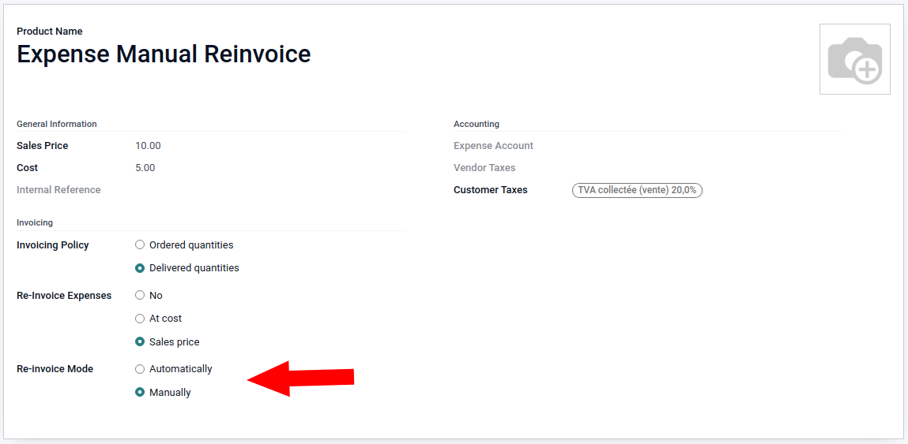

On the **Expense Product**, set the **Re-invoice Mode**:

* Automatically: Expenses are automatically re-invoiced when they're posted (standard)
* Manually: Expenses have to be manually re-invoiced by a manager

