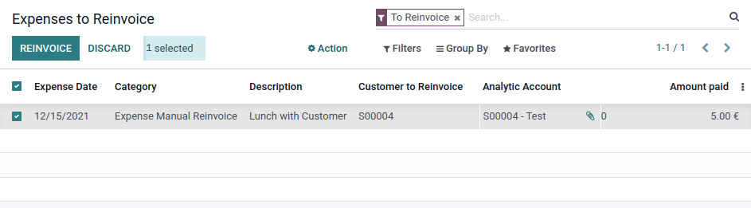

After Expenses of products configured with **Manual** Re-invoice Mode have been
approved and posted, find them under the **Expenses to Reinvoice** menu.

Review their **Customer to reinvoice** field, select the ones you want to process
and click either **Reinvoice** or **Discard**

Discarded expenses will be hidden from the list, but you can still access them by
removing the default search filter.
